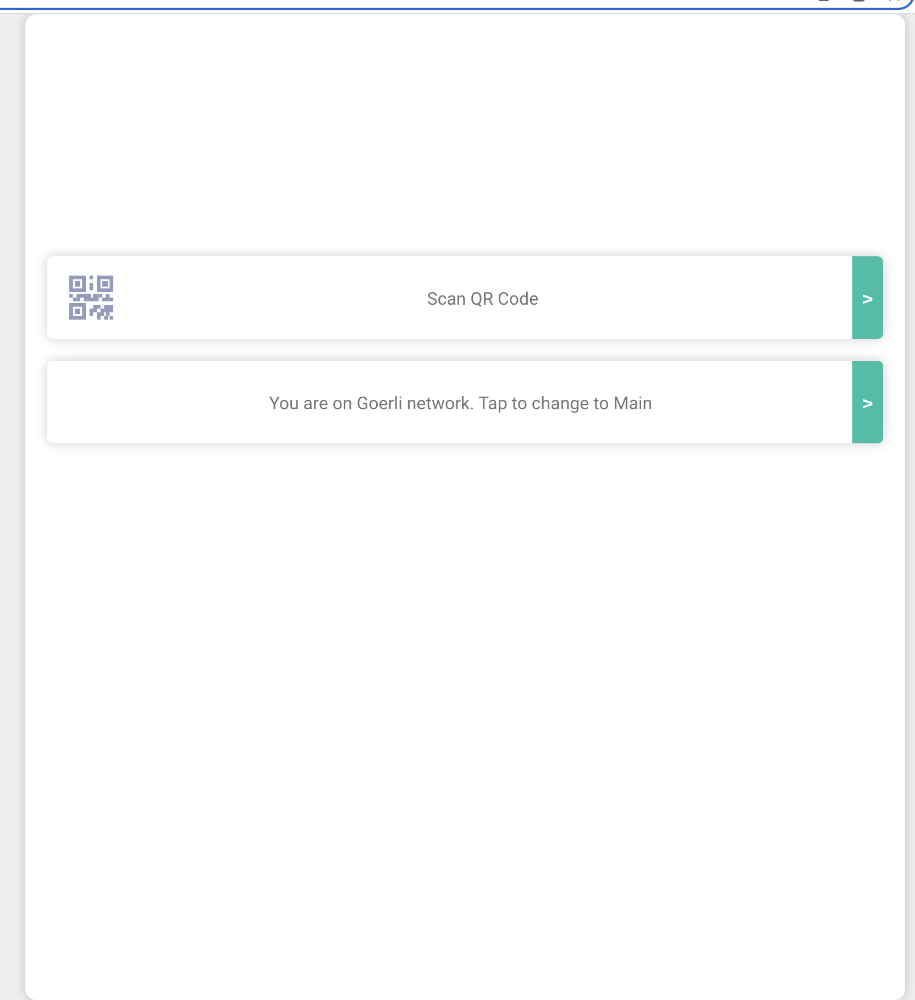

# Devery QR Code Reader

This project is a sample QR Code reader that checks if a product exists on the Devery Protocol inside the blockchain. The QR Code reader uses the Devery Protocol to verify the authenticity and details of a product. The application has a simple interface to scan QR codes and view product information if it exists on the blockchain.



## Components

The project consists of the following main components:

1. **deveryService.ts**: This file contains the main functionality for interacting with the Devery Protocol. It includes functions for loading product information from the blockchain and toggling between different network IDs.

2. **searchResultPage.tsx**: This component displays the result of a product search after scanning a QR code. It shows whether the product was found or not and the relevant product details if it exists on the blockchain.

3. **QrCodeReader.tsx**: This component is responsible for handling the QR code scanning functionality. It uses the `react-qr-reader` library to access the camera and scan QR codes.

### How Components Interact

- When a user scans a QR code using the `QrCodeReader` component, it triggers the `onResult` callback function. This function receives the scanned QR code result, and if the result is valid, it navigates to the `searchResultPage` component with the product ID as a URL parameter.

- The `searchResultPage` component uses the product ID from the URL parameter to call the `loadProductByAddress` function from the `deveryService.ts` file.

- The `loadProductByAddress` function interacts with the Devery Protocol using the `DeveryRegistry` class to fetch the product information from the blockchain. If the product is found and active, the product information is returned and displayed on the `searchResultPage` component.

- If the product is not found or inactive, an error message is displayed on the `searchResultPage` component.

## Setup

To set up the project, follow these steps:

1. Clone the repository.

```
git clone <repository_url>
```

2. Change the current directory to the project folder.

```
cd <project_directory>
```

3. Install the required dependencies.

```
npm install
```

4. Start the development server.

```
npm start
```

Now, you can access the application at `http://localhost:3000`.

## Usage

To use the application, simply point the camera at a QR code, and the app will automatically scan it. If the product is found on the blockchain, the app will display the product information. If not, an error message will be shown.
